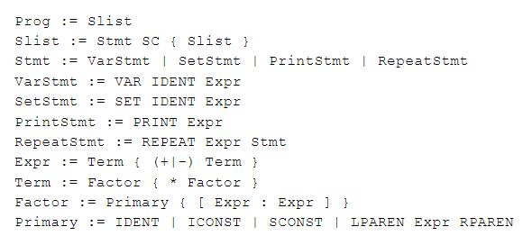

# Interpreter
An interpreter for a simple (unofficial) language written in C++

***

These are the grammar rules of the language:

***

### Usage
Enter `main` to read in from standard input or `main <file>` to read from a file.

